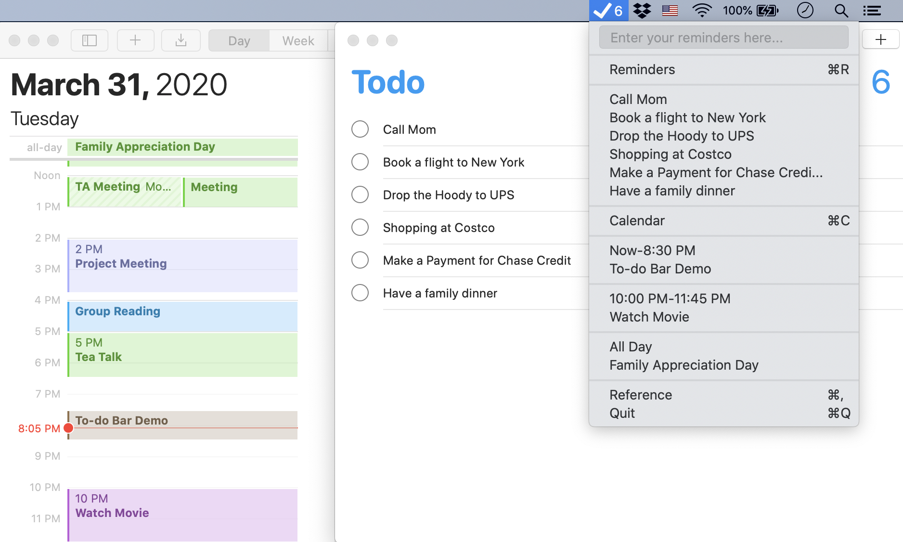
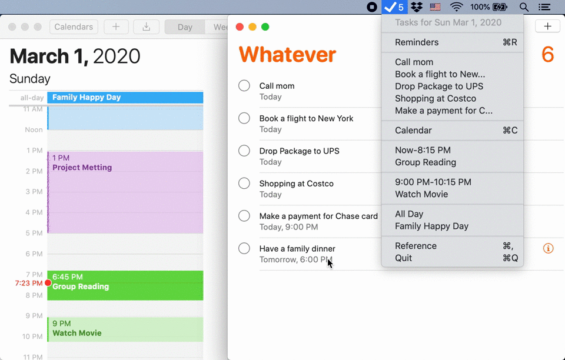

	

<a href="https://github.com/ZhexiongLiu/TodoBar/releases/latest">
 		
	
	

## To-do Bar
To-do Bar empowers [MacOS](https://www.apple.com/macos/) [Reminders](https://support.apple.com/guide/reminders/)/[Calendar](https://support.apple.com/guide/calendar/) interms of menu bar.

	
	

## Manual download

* [Download latest version](https://github.com/ZhexiongLiu/TodoBar/releases/latest)
* Open and drag the app to the Applications folder.

## Usage

* Grant To-do Bar access to your MacOS Reminders/Calenders.
* Click To-do Bar menu icon to show your todo list.
* Click your reminder items to mark as completed.
* Calendar items would be hidden when time passed.

	

## License

MIT &copy; [Zhexiong Liu](https://github.com/ZhexiongLiu)
